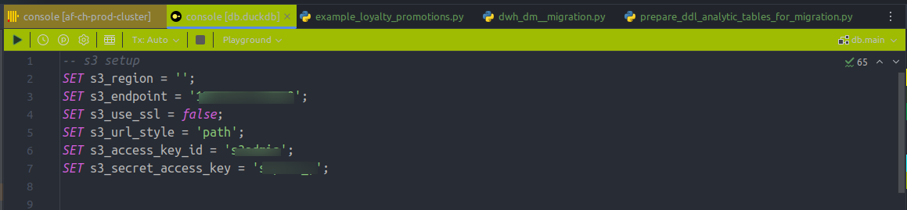

# Pycharm

Настройки цветовой схемы для коннекторов.

1. Щелкаем правой кнопкой на коннекте, нажимаем Properties

2. И сразу видим выбор цвета, щелкаем и наслаждаемся выбором

На выбор есть стандартная палитра и кастомная

2.1 Как это выглядит в окне редактора (немного локальных кредов =))

# Dbeaver

1. Окно коннектов

2. Правой кнопкой -> Edit connection

3. В окне настроек выбираем General

4. Кастомизация настроек по кнопке Edit connection types

Окно редактора:

