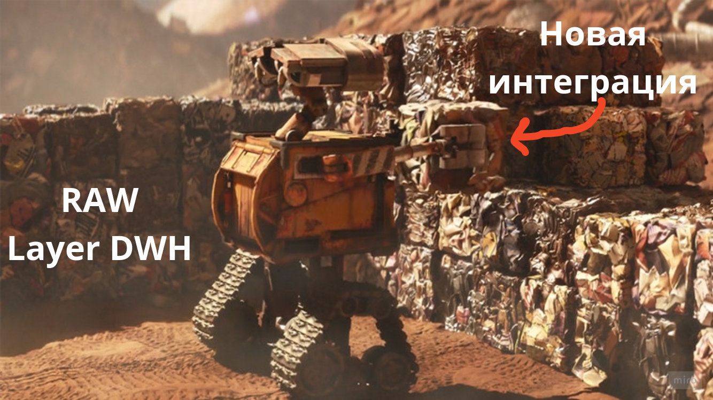

**WALLE**



Заботливо дадим красивое имя фреймворку `Walle`, почему так:
- он строит фундамент DWH ( всё отгружаем на S3)
- построение фундамента - самая грязная работа (не считая подготовки данных от RAW до STAGE слоя)
- да, это просто красиво 😍 (не называть же его YetAnotherDagGenerator или FrameWork №Х)

К предыдущему посту вопросиков накидали:

```
А проблемы при этом возникают, что твоя автоматизация не умеет все, что надо, её надо дописывать, 
тестить, рефакторить, иногда не работает… и это ради 10 строчек кода?
```

1. `автоматизация не умеет всё` - справедливо, но всё и не надо. Применяем правило Парето: 
Автоматизируем 80% рутинной работы и оставим место нетривиальным кейсам (чтобы инженеру было где поразмять извилины 🤯)
2. `рефакторить` - Отвечу вопросом на вопрос: а неавтоматизированные даги рефакторить не надо? Написал один раз и забыл, нет
я такого не видел. Даже с точки зрения устаревания какого-то процесса, при автоматизации удобнее: убрал yml в архив и всё.
В общем тут посыл такой: если есть любой код - ему нужен рефактор
3. `иногда не работает` - справедливо, сделаю отсылку к п2: любой код может не работать =). Также вижу пользу: если не работает то, для всего - нет специфических проблем.
Очень не нравиться копаться в чужом коде, разбирая, что же там сломалось (хех, можно заметить, что если автоматизацию писал не ты, то это тоже чудой код =))
4. `тестить` - пффф, какие тесты. *уяк - *уяк и в продакшен
Честно, очень бы хотелось, но пока тестирование только в dev среде или на персональном стенде.


Общий посыл автоматизации такой:

```
Нет стремления покрыть 100% кейсов, есть желание написать код, в котором в одних и тех местах вызываются коннекшены, они имеют 
одинаковые названия, код переиспользуется (для алертинга используется 1 и только 1 функция или стандартный набор, а не 8 различных фукнций 🤦‍♂️),
таски\даги - имеют одинаковый нейминг и одинаковую структуру и тд...
```

tags:
- walle
- framework
- automate


