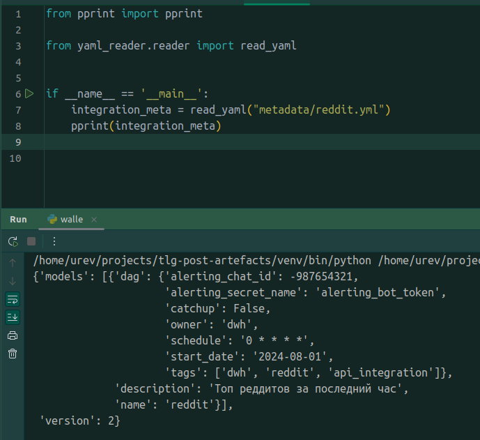
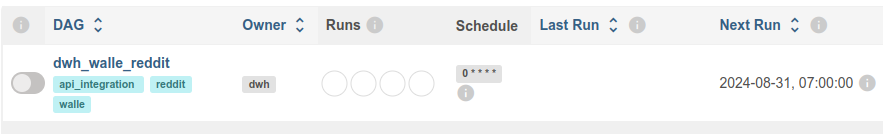
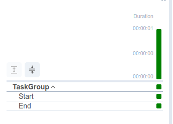

**WALLE - Готовим yml**


Во [вступительном посте](https://t.me/double_data/143) оговорили, что фундамент фреймворка - yml конфиг. 
Надо научиться читать его и формировать некую стркутуру для управления фреймворком.

Реализуем базу:
- все конфиги храним в директории `metadata`
- читаем директорию `metadata`
- данные из yml храним в переменной, например: `integration_meta`
- `integration_meta` подается на вход функции создания дага `create_dag(integration_meta)`

Какие минимальные данные необходимы для формирования дага:
- dag_id
- расписание (но это не точно)
- дата старта\окончания (мы же хотим управлять процессом)
- catchup
- куда алертить (помним, что хотим единый алертинг: в нашем случае будет телеграмм, поэтому нужен channel_id + токен)
- общая информация (owner\tags\description)

С одной стороны конфиг должен знать что-то про нашу интеграцию, с другой у него должно быть что-то общее (про даг и про задачу),
попробуем выделять независимые секции в конфиге под эти задачи. Начнем с такого:

```yaml
version: 2
models:
  - name: reddit # имя интеграции, оно же dag_id
    description: Топ реддитов за последний час # описание интеграции, оно же dag_description
    dag:
#      dag_id: "" # можно переопределить dag_id != name
      schedule_interval: 0 * * * *
      start_date: '2024-08-01'
#      end_date: '2024-08-31'
      catchup: False
      alerting_chat_id: -987654321
      alerting_secret_name: alerting_bot_token
      owner: dwh
      tags: 
        - dwh
        - reddit
        - api_integration
```

ps: по API будем забирать топ реддитов за последний час (данных там копейки, десятки строк, но нам не так важно кол-во)

Сохраняем наш первый yml 🥳

.

**Учимся читать**

.

Ничего необычного, Python библиотека [pyyaml](https://pyyaml.org/wiki/PyYAMLDocumentation) уже всё умеет.
От нас достаточно открыть файл, прочитать содержимое как текст и далее прогрузить через библиотеку `pyyaml`. Немного шаблонного кода:

```python
import yaml

def read_yaml(path_to_file: str):
    with open(path_to_file, "r") as f_yaml:
        try:
            content = yaml.safe_load(f_yaml)
            return content
        except yaml.YAMLError as e:
            print(e)
```

Добавил обработку ошибок `try\except` - чуть-чуть защиты от сломанных файлов yml.

Проверяем работу реализованной функции (скрин в репе):



```python
{'models': [{'dag': {'alerting_chat_id': -987654321,
                     'alerting_secret_name': 'alerting_bot_token',
                     'catchup': False,
                     'owner': 'dwh',
                     'schedule_interval': '0 * * * *',
                     'start_date': '2024-08-01',
                     'tags': ['dwh', 'reddit', 'api_integration']},
             'description': 'Топ реддитов за последний час',
             'name': 'reddit'}],
 'version': 2}
```

`yaml.safe_load` возвращает данные в виде python-словаря. Еще немного шаблонного кода для создания AirFlow дага и мы на финишной прямой:
- реализуем функцию `create_dag`, она должна возвращать объект `DAG` (`from airflow import DAG`)
- объект даг нужно положить в `globals()`, чтобы AirFlow смог узнать про наш даг
- пусть даг имеет следующую структуру:
  - 1 таск группа
  - таска start (EmptyOperator)
  - таска end

Мои маленькие дата инженеры - это подлежит самостоятельной реализации 😉. Мою реализацию посмотреть [тут]()
.
Ну и плюс, код который будет читать все конфиги из директории `metadata` (тут в помощь модуль из стандартной либы python `os`) и формировать даги. Дерзаем💪

У меня получилась такая структура папок:
```
- src:
  - /common:
    - func.py
  - /metadata:
    - reddit.yml
  - /yaml_reader:
    - reader.py
  - walle.py
```

Загружаем в AirFlow, наслаждаемся картиной (она в [скринах]())





На этом самая простая часть закончилась🙃

tags:
- walle
- framework
- automate