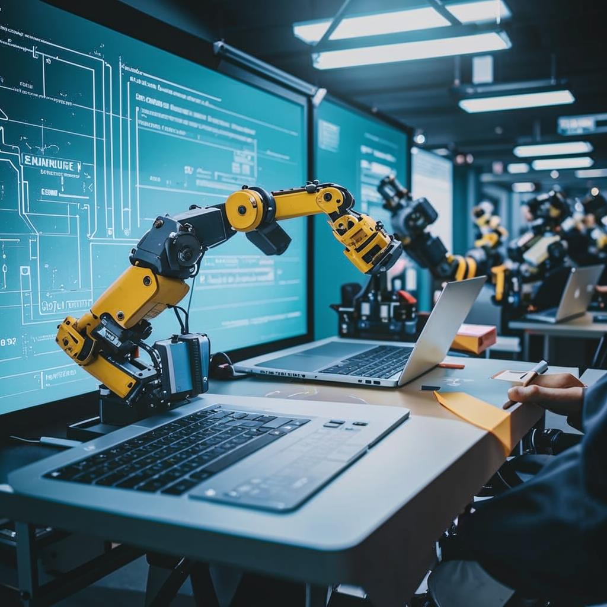

# Как построить framework и ничего не сломать

ps: то, что думает Кандинский на тему фреймворков\AirFlow\Python и тд.

Вся серия постов:
1. [Моё имя Walle и FAQ](https://github.com/urevoleg/tlg-post-artefacts/blob/main/framework_story_v1/README-2.md)
2. [Пишем новый YML](https://github.com/urevoleg/tlg-post-artefacts/blob/main/framework_story_v1/README-2.md)
3. [WALLE - Готовим yml](https://github.com/urevoleg/tlg-post-artefacts/blob/main/framework_story_v1/README-3.md)
4. [WALLE - Выстраиваем структуру](https://github.com/urevoleg/tlg-post-artefacts/blob/main/framework_story_v1/README-4.md)