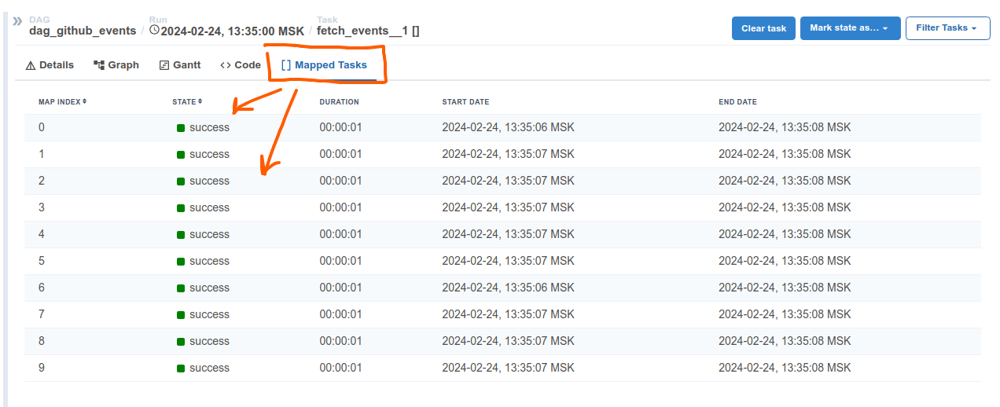
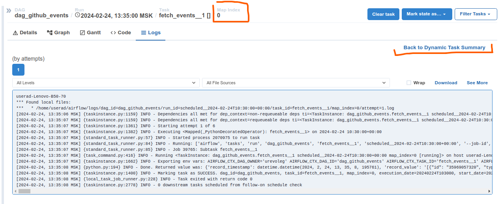

# TaskFlow and Dynamic Task Mapping

## Как отображается динамический маппинг

У такой таски появляется вкладка `Mapped Tasks`, в ней отображаются все имеющиеся таски, 
для управления каждой из них необходимо провалиться в неё (кликнуть на нужной)




Каждая mapped task открывается как обычная таска, её можно перезапустить. Сверху указан индекс просматриваемой
таски `Map Index` (на скрине 0). Есть кнопка возврата к списку mapped tasks



## Результат одного маппинга можно подавать в другой

В коде реализована возможность передачи результата mapped task. То есть 
для каждого `fetch_events` будет запущена `insert_into_db`

```python

    fetch_events_by_url = fetch_events.expand(url=prepared_links)

    insert = insert_into_db.expand(fetch_object=fetch_events_by_url)

```